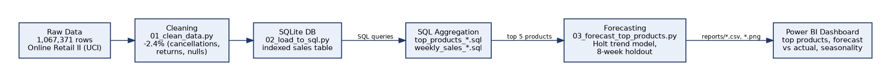

# Retail Sales Forecasting & Inventory Analytics

End-to-end analysis of a real UK-based online retailer's transaction history —
cleaning, SQL-based aggregation, and time-series forecasting on top-selling
products, aimed at answering: *what should this business expect to sell next,
and where does a simple forecast start to break down?*

## Dataset
**Online Retail II** — UCI Machine Learning Repository (donated by Dr. Daqing
Chen, CC BY 4.0). All transactions from a UK-based, non-store online retailer
of all-occasion gift-ware, **1 Dec 2009 – 9 Dec 2011**.
- 1,067,371 raw transaction line items
- 1,041,670 after cleaning (2.4% dropped — cancellations, non-positive
  quantity/price, missing product codes)
- Source: https://archive.ics.uci.edu/dataset/502/online+retail+ii

## Pipeline



1. **`notebooks/01_clean_data.py`** — drop cancelled invoices, returns, and
   incomplete rows; add a `Revenue` column.
2. **`notebooks/02_load_to_sql.py`** — load the cleaned data into a SQLite
   database (`data/retail.db`) as a proper `sales` table, indexed on
   `StockCode` and `InvoiceDate`.
3. **`sql/`** — the actual aggregation queries used, run against the database
   (not just Pandas groupbys):
   - `top_products_by_revenue.sql`
   - `top_products_for_forecasting.sql` — refined to exclude administrative
     line items (postage, manual adjustments) and single-order outliers
   - `weekly_sales_by_product.sql`
4. **`notebooks/03_forecast_top_products.py`** — builds a weekly demand
   series per top product, holds out the last 8 weeks, and fits an
   exponential smoothing forecast.

## Key findings
- **A data-quality catch before any modeling happened**: the naive "top
  products by revenue" query ranked postage fees and a single 80,995-unit
  bulk order alongside real products. Excluding non-product codes and
  requiring ≥30 distinct orders per product was necessary before the
  ranking (or any forecast) was trustworthy.
- **Weekly revenue is highly seasonal**: average weekly revenue in
  November–December is **75.4% higher** than the rest of the year
  (£312,730/week vs. £178,279/week) — see `reports/weekly_revenue_trend.png`.
- **The forecast model has an honest, documented limitation**: with only
  ~2 years of history, there isn't enough data to reliably fit a 52-week
  seasonal component (statsmodels' own initialization check confirms this).
  A trend-only exponential smoothing model was used instead, and — visibly,
  in `reports/forecast_top5.png` — it **underestimates the holiday-season
  uplift** for every top product. That gap is itself the finding: a
  production version of this forecast would need a longer history or an
  explicit seasonal adjustment layered on top.
- Forecast accuracy on an 8-week holdout ranged from **24.9% to 74.5% MAPE**
  across the top 5 products (`reports/forecast_accuracy.csv`) — products
  with steadier week-to-week demand (Regency Cakestand) forecast far more
  reliably than spikier ones (Party Bunting).

## Dashboard
`reports/top_15_products_clean.csv`, `reports/forecast_accuracy.csv`, and
`reports/weekly_revenue_trend.png` are structured for a Power BI dashboard:
top-product ranking, actual-vs-forecast by product, and the weekly
revenue/seasonality trend.

## Tools
Python (Pandas, statsmodels, Matplotlib), SQL (SQLite), Power BI.

## Reproducing this analysis
The raw and cleaned data files (93-98MB) and the SQLite database (147MB)
aren't committed to this repo — they're too large for git. To reproduce:
1. Download the dataset from the UCI link above (or its Kaggle mirror,
   "Online Retail II UCI").
2. Place it at `data/online_retail_II_raw.csv`.
3. Run `notebooks/01_clean_data.py`, then `02_load_to_sql.py`, then
   `03_forecast_top_products.py` in order.
The small output files this pipeline produces (top-products lists, forecast
accuracy, charts) *are* committed, under `reports/`.

## Repo structure
```
retail-sales-forecasting/
├── data/            raw + cleaned CSVs, retail.db (SQLite)
├── sql/             aggregation queries used in the analysis
├── notebooks/        cleaning, loading, and forecasting scripts
├── reports/         charts, accuracy metrics, top-products output
└── dashboard/        Power BI file (to be added)
```
